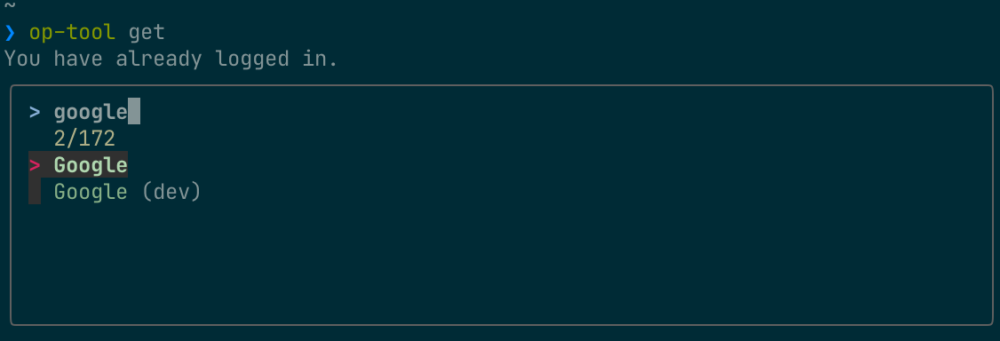

# op-tool

`op-tool` makes it convenient to use [1Password command-line tool](https://support.1password.com/command-line/).

- Copy credential to clipboard
- Support [fzf](https://github.com/junegunn/fzf)
  - Select item
  - Select field ("Password", "One-Time Password" and so on.)
- Restore 1Password CLI session
  - If session is expired, op-tool recreate session and restore it.

## Requirement

`op-tool` require these tools.

- 1Password
- 1Password command-line tool (`op`)
  - Please signin to 1Password account by executing `op signin`.
  - <https://support.1password.com/command-line/#sign-in-or-out>
- jq
- fzf

### Using Homebrew

```shell
brew cask install 1password-cli
brew install jq fzf
```

## Installation

To install `op-tool`, please use below methods.

### Using [Zinit](https://github.com/zdharma/zinit)

```shell
zinit ice pick"bin/op-tool" as"program"
zinit light m1yam0t0/op-tool
```

### Install Manually

Clone this repository.

```shell
git clone https://github.com/m1yam0t0/op-tool.git
```

Set PATH to repo

```shell
export PATH="${PATH}:/path/to/op-tool/bin"
```

## Usage

### main command

```shell
❯ op-tool -h
op-tool - make it convenient to use 1Password CLI

Usage:
    op-tool <command> [<args>]
    op-tool -h | --help
    op-tool -v | --version

Commands:
    get                 Get password from 1Password Vault
    session             Restore op session

Options:
    -h, --help          Show this message
    -v, --version       Print the op-tool version
```

### op-tool get

```shell
op-tool get - Get credential from 1Password

Usage:
    op-tool get [(-n|--name) <name>] [(-f|--field) <field>] [(-i|--interactive)] [--otp]
    op-tool get -h | --help
    op-tool get -v | --version

Options:
    -n, --name          1Password item name
    -f, --field         1Password item fields
    -i, --interactive   Select field interactive
    --otp               Get One-time Password
    -h, --help          Show this message
    -v, --version       Print the op-tool version
```

op-tool provides an interactive interface with a fuzzy-finder(fzf).

- select item



- select field

.png)

Copy credential from 1password.

```shell
~
❯ op-tool get
You have already logged in.
Copied 1Password item to clipboard. (item=Google, field=password)
```

Get specific item

```shell
❯ op-tool get -n "Google"
You have already logged in.
Copied 1Password item to clipboard. (item=Google, field=password)
```

Get optional field (default=password).

```shell
❯ op-tool get -n "Google" -f "username"
You have already logged in.
Copied 1Password item to clipboard. (item=Google, field=username)
```

Copy One-Time password

```shell
❯ op-tool get -n "Google" --otp
You have already logged in.
Copied 1Password item to clipboard. (item=Google, field=One-time Password)
```

## op-tool session

Restore 1Password CLI session to `${XDG_CONFIG_CACHE}/op/session`

```shell
❯ op-tool session
[ERROR] 2020/08/08 18:10:03 You are not currently signed in. Please run `op signin --help` for instructions
Enter the password for <email_address> at my.1password.com:
op session restored.
```

```shell
❯ cat ~/.cache/op/session
export OP_SESSION_my="xxxxxxxxxxxxxxxxxxxxxxxxxxxxxxxxxxxxxxxxxxxx"
# This command is meant to be used with your shell's eval function.
# Run 'eval $(op signin my)' to sign in to your 1Password account.
# Use the --raw flag to only output the session token.
```
